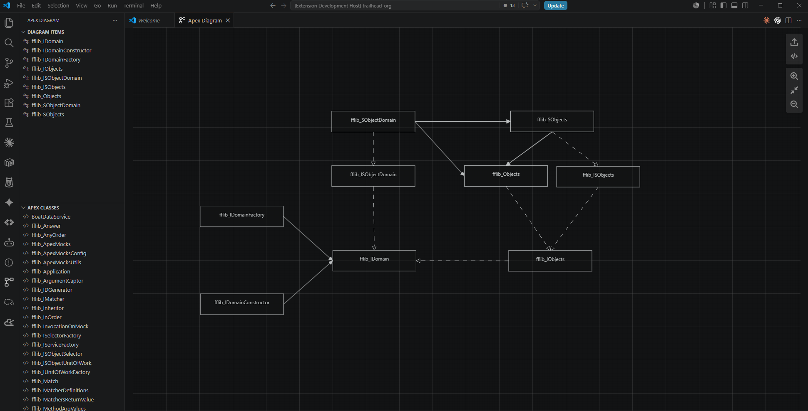

# Apex Diagram

Apex Diagram is a Visual Studio Code extension for exploring Apex class dependencies as a UML-style class diagram.

The extension connects to the Salesforce org configured for the current workspace, loads Apex classes through the Tooling API, and lets you build an interactive diagram from selected classes.

## Features

- Browse Apex classes from a dedicated **Apex Diagram** activity bar view.
- Add one or more Apex classes to a diagram workspace.
- Visualize class relationships detected from Apex symbol tables:
  - inheritance from parent classes;
  - interface realization;
  - directed associations from external class references.
- Keep selected diagram items in a separate view so they can be removed or reopened quickly.
- Open the local `.cls` file for a diagram item when it exists in the workspace.
- Preserve diagram state and node positions between webview sessions.
- Export the current diagram as SVG.
- Clear the local Apex symbol table cache when Salesforce metadata changes or cached data looks stale.

## Preview

Add screenshots or GIFs here before publishing.

Suggested assets:

- `images/apex-diagram-activity-bar.png`: show the Apex Diagram activity bar with the Apex Classes and Diagram Items views.
- `images/apex-diagram-workspace.png`: show a populated diagram with inheritance, interface, and association links.
- `images/apex-diagram-add-classes.gif`: show selecting one or more Apex classes and adding them to the diagram.
- `images/apex-diagram-export.gif`: show exporting the diagram to SVG.

```md





```

## Requirements

- Visual Studio Code `1.96.0` or newer.
- Salesforce CLI installed and available from your terminal.
- A Salesforce project opened as the active VS Code workspace.
- An authorized Salesforce org for that workspace. The extension uses Salesforce CLI user info to connect to the org.
- Access to the Salesforce Tooling API for the target org.

The extension reads Apex class metadata from Salesforce. It does not require Apex source files to build the dependency diagram, but opening a class file from the diagram requires the matching `.cls` file to exist in the local workspace.

## Getting Started

1. Open a Salesforce project in VS Code.
2. Make sure the project is authorized against the Salesforce org you want to inspect.
3. Open the **Apex Diagram** activity bar item.
4. Use **Apex Classes** to find classes available in the org.
5. Click **Add** on a class, or select multiple classes and add them together.
6. Click **Show Diagram** from **Diagram Items** to open the diagram workspace.
7. Use the diagram toolbar to zoom, reset zoom, inspect source, or export SVG.

## Commands

This extension contributes the following commands:

- **Apex Diagram: Open Apex Diagram Workspace** opens the diagram webview.
- **Apex Diagram: Show Diagram** opens the current diagram from the Diagram Items view.
- **Apex Diagram: Refresh** reloads the Apex class list from Salesforce.
- **Apex Diagram: Clear Cache** clears cached Apex symbol table data.
- **Apex Diagram: Clear Diagram** removes all current diagram items.
- **Add** adds selected Apex classes to the diagram.
- **Remove** removes selected classes from the diagram.
- **Open File** opens a local `.cls` file for a diagram item when found in the workspace.

## Extension Settings

Apex Diagram does not currently contribute VS Code settings.

## How Dependency Detection Works

Dependency information is generated from Salesforce Apex symbol tables. Links are created only when both sides of the relationship are included in the selected diagram data.

- Parent classes become **Inheritance** links.
- Implemented interfaces become **Realization** links.
- External references become directed association links.

Namespaced classes are matched by `namespace.name`. Non-namespaced classes are matched by `name`.

## Known Limitations

- The initial Apex class list hides likely test classes by name pattern. This is a performance-oriented heuristic and not a guaranteed `@IsTest` detector.
- Relationships are shown only between classes included in the diagram input set.
- Opening a class file depends on finding a matching local `.cls` file in the workspace.
- The extension requires a Salesforce workspace and an authorized org during activation.

## Troubleshooting

- If no classes appear, verify that the workspace is a Salesforce project and that Salesforce CLI can resolve the authorized org.
- If dependencies look outdated, run **Apex Diagram: Clear Cache** and add the classes again.
- If **Open File** cannot find a class, confirm that the class source exists locally as `<ClassName>.cls`.

## Release Notes

### 0.0.1

Initial preview release.
